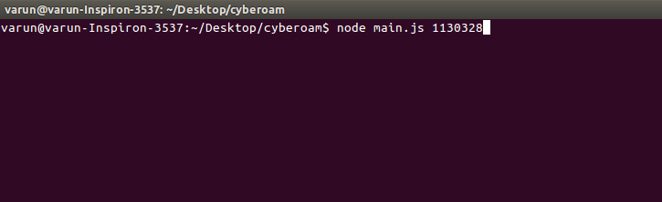
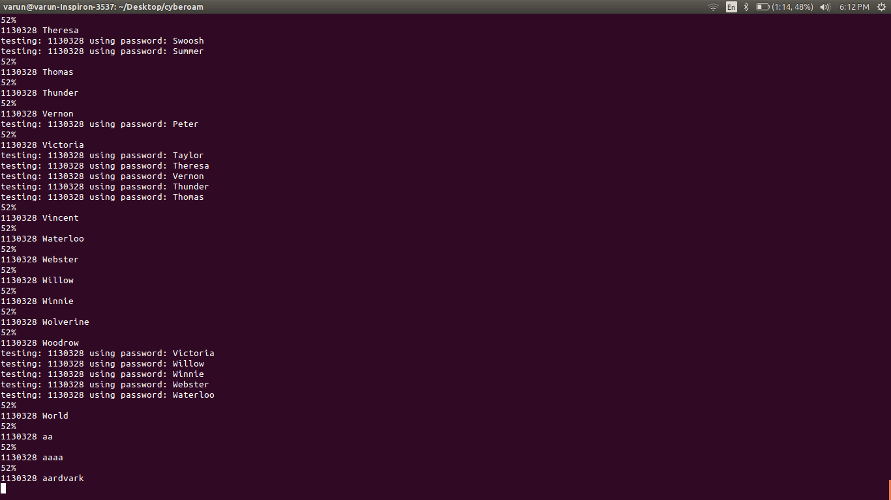
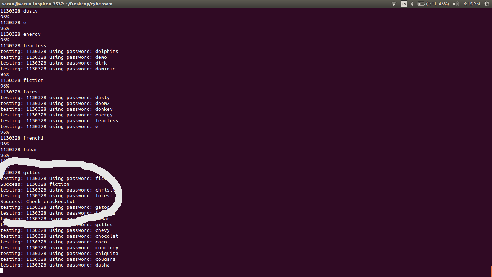
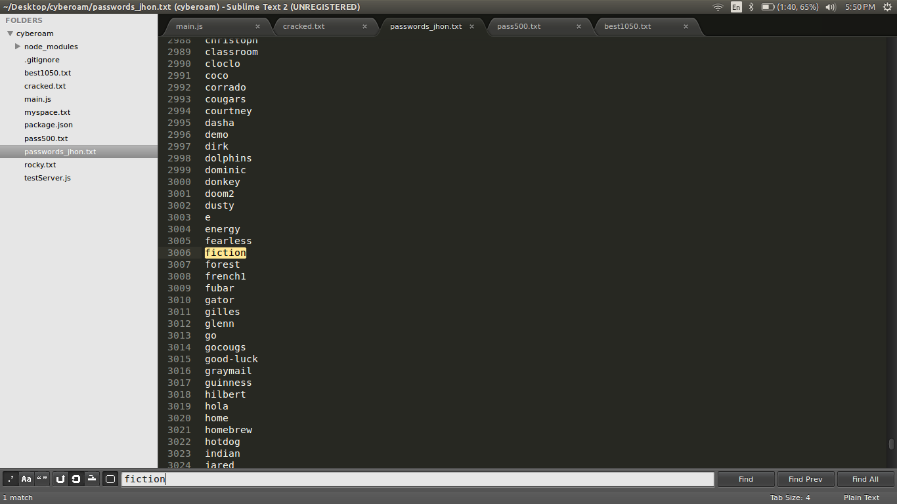
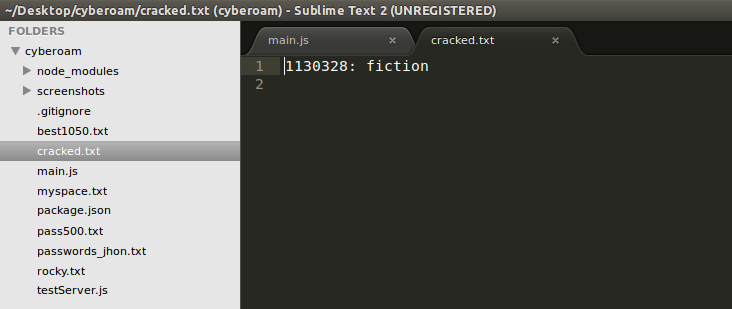
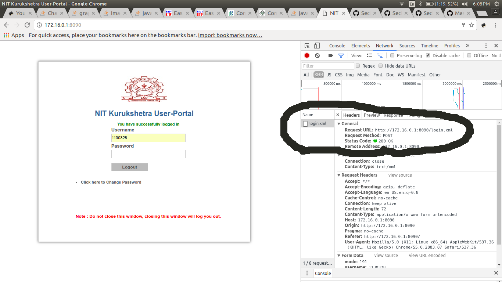
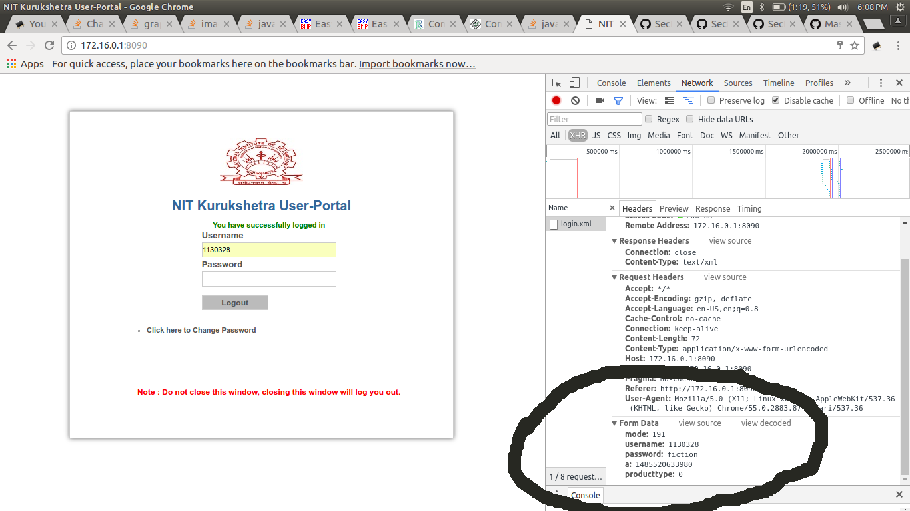
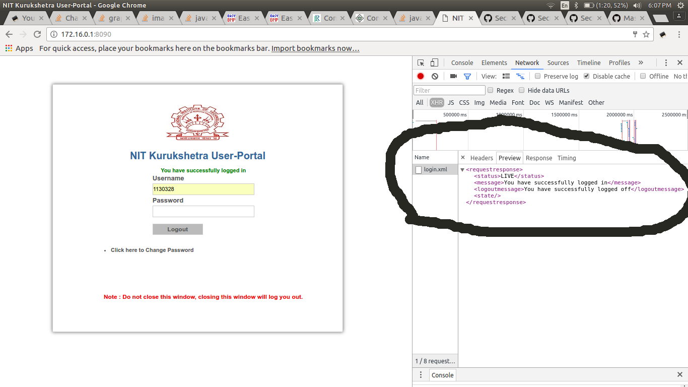

# Dictionary Attack on NIT Kurukshetra User-Portal (Cyberoam)
### A nodejs script to guess cyberoam password for any given username

##### Disclaimer:
I wrote this script just to demonstrate that how some one with a fair knowledge of web-development can exploits
weak passwords. I chose our college captive portal for experiment but same principle can be applied to any website
which are vulnerable to attack. This is just for education purpose and I do not intend to steal any information.

###### Dictionary Attacks:
A dictionary attack is based on trying all the strings in a pre-arranged listing, typically derived from a list of
words such as in a dictionary. In this demo, I am going to use a text file passwords_jhon.txt (see the file above)
containing approx 3000 common passwords.
Dictionary attacks often succeed because many people have a tendency to choose short passwords that are ordinary 
words or common passwords, or simple variants obtained, for example, by appending a digit or punctuation character.

###### Base of attack
Students of NIT Kurukshetra are too lazy to choose a strong password for captive portal :stuck_out_tongue:
Also cyberoam does not block multiple login requests from same ip-address within a short span of time. 

###### How to execute this script?
1. To execute this script you must have nodejs installed.
2. Download zip file (or make git clone) and extract to hard disk
3. Open terminal/cmd
4. Move to script directory (where you extracted zip file) using `cd /path/to/repository`
5. Run `npm install` to install all nodejs dependencies
6. Once all the dependencies has been installed type `node main.js 1130328 passwords_jhon.txt`
7. Replace 1130328 with any valid Roll no on which you want to perform attack (see screenshots)
8. Sit back and enjoy coffee. If victim's password is weak, it will be cracked and saved to cracked.txt file. 
9. You can see progress on your screen (see screenshots- it will take some minutes).

###### Screenshots

1. How to exceute-  
2. Progress-  
3. Password successfully guessed- 
4. 1130328 password in password file-  
5. Saved password in file- 

#### Working
This script tries all passwords from passwords_jhon.txt one by one for supplied username and simulate login to 
Captive portal i.e. make HTTP Post requests. To make http post requests you need an URL and Form data. 
To check URL and Form data made during post requests i.e. when you signin to portal, perform following steps-

1. Visit http://172.16.0.1:8090/ (User portal)
2. Choose inspect from right click or press Ctrl + Shift + I
3. Select Network tab from opened window 
4. Now perform login using your roll no and password and check network tab
5. You will see an http request made by your browser. Click on login.xml and check Headers
6. You will see url to be http://172.16.0.1:8090/login.xml - 
7. scroll a little bit and check Form data. 
8. You will see different parameters and their values. 
9. 'mode' 191 is for login (193 for logout) and parameter 'a' is timestamp 
11. Using this url and form parameters, this script make http post request (as if an user is trying to login)
12. Once you have successfully logged in, Check the preview section
13. Browser receives an XML response on successful login.  
14. Script validate against this response to decide if attack was successful. 

###### Further enhancement
You can use different and customized password files (of different lengths) to have successful attack. This script
make each request per 100 milliseconds. You can decrease it for a faster execution. Initially I had used 60 ms 
but I was getting random Time-out error so I chose 100ms. For more details see source code of main.js file. 
Reference: I downloaded password file from this repo- 
https://github.com/danielmiessler/SecLists/tree/master/Passwords
   
